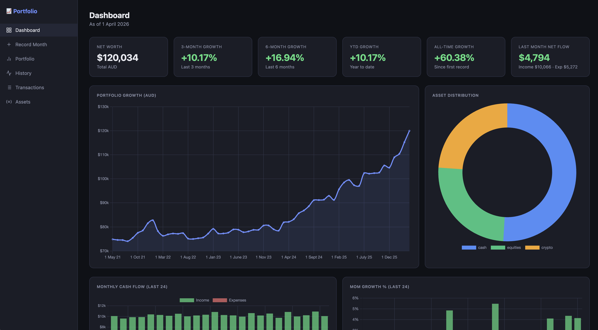
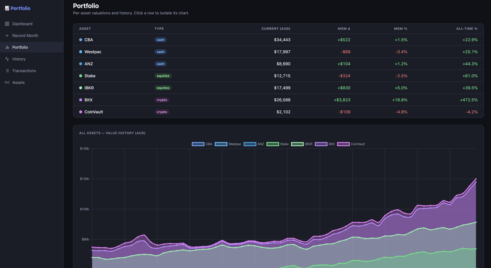

# Portfolio Tracker

Personal finance web app for tracking net worth, asset valuations, cash flows, and equity distribution over time. Monthly snapshot model — record end-of-month balances for each asset, plus income/expense totals.

## Screenshots





## Stack

- **Backend**: Python 3.12, FastAPI, SQLAlchemy 2.0, Postgres 16
- **Frontend**: React 18, Vite, React Router v6, Chart.js via react-chartjs-2
- **Package management**: PDM (backend), npm (frontend)
- **Dev DB**: Docker Compose (`docker-compose.yml` at repo root)

## Running locally

```bash
# Postgres
docker compose up -d

# Backend (first time: pdm venv create 3.12 && pdm install)
cd backend
pdm run dev            # uvicorn main:app --reload on :8000

# Frontend
cd frontend
npm install            # first time only
npm run dev            # Vite on :5173, proxies /api to :8000
```

## Data model

**Asset** — user-defined account (name, type, currency, colour, display_order).  
Types: `cash | equities | crypto | property | bonds | other`.  
Currencies: `AUD | USD | EUR | GBP`.

**Snapshot** — end-of-period valuation per asset. POST to `/api/snapshots/` upserts on `(asset_id, period)`. `value_native` is in the asset's own currency; `value_aud` is the AUD-converted figure used everywhere. Missing periods are forward-filled from the last known value.

**CashFlow** — one row per month: income + expenses. Upserts on `period`. If no explicit record exists for a period, the dashboard infers income/expenses from the snapshot delta vs the last period with real data.

**Transaction** — individual line items. `is_derived=true` rows are auto-generated from snapshot deltas (one per asset per period, associated via `to_asset_id` for gains and `from_asset_id` for losses); editing one clears the flag and makes it permanent.

**Category** — managed list of transaction categories. `/api/categories/` returns the union of managed entries and any category strings already present on transactions.

**FxRate** — cached monthly-average exchange rates to AUD, fetched from [Frankfurter](https://frankfurter.app) on first request per period.

## API base

All routes are prefixed `/api`. FastAPI auto-docs at `http://localhost:8000/docs`.

## FX rates

When recording a month, the frontend auto-fetches the monthly-average rate for each non-AUD currency used by your assets. Rates are cached in the `fx_rates` table. To force a re-fetch for a period:

```bash
curl -X DELETE "http://localhost:8000/api/fx-rates/?period=2024-01-01"
```

## Excel import

```bash
python import_excel.py --file /path/to/Accounting.xlsx
```

### Sheet format

**First sheet** — portfolio snapshots:

| Period | Income | Expenses | CBA | Stake | IBKR |
|--------|--------|----------|-----|-------|------|
| *(header)* | | | | | |
| *(metadata)* | | | `AUD,cash` | `USD,equities` | `USD,equities,AUD` |
| 2024-01-01 | 9500 | 4200 | 32000 | 4500 | 18000 |

Row 2 is the metadata row — `currency,type[,excel_currency]` for each asset column:

- `AUD,cash` — AUD asset, values in AUD
- `USD,equities` — USD asset, column values are in USD (native)
- `USD,equities,AUD` — USD asset, but column values are already in AUD; native USD value is back-calculated from the FX rate

Supported type aliases: `equity/equities/stock`, `cash/savings`, `crypto`, `property/real estate`, `bonds/bond`, `other`.

Assets are created automatically on first import. Safe to re-run — snapshots and cashflows upsert; derived transactions are reconciled at the end.

**Transactions sheet** (optional):

| Date | Description | Amount | Category |
|------|-------------|--------|----------|

### Generate sample data

```bash
python generate_sample.py   # writes sample.xlsx
```

## Key conventions

- Periods are always stored as the **first day of the month** (`date` type, not datetime).
- All monetary values stored as `Numeric(18,2)` in Postgres; never float.
- Frontend fetches from `/api` — Vite proxies to `:8000` in dev; set `VITE_API_URL` for production.
- `Base.metadata.create_all` runs on startup. Columns added after initial table creation require a manual `ALTER TABLE`.

## FAQ

**Why do I see transactions I never entered?**  
After each month is recorded, the app auto-generates one derived transaction per asset representing the portfolio change (gain or loss). These are labelled *Derived* in the Transactions page. They exist so the cashflow bar chart and income/expense totals have something to display even without manually imported bank transactions. Editing a derived transaction removes the label and makes it permanent.

**Why does income/expenses show a value when I didn't enter any?**  
If you don't fill in the Income and Expenses fields when recording a month, the dashboard infers them from the net change in your total portfolio value since the last period where real data was entered. This is a rough approximation — replace it with actual figures by editing the cashflow record for that month.

**What happens if I skip a month?**  
Missing snapshots are forward-filled: each asset carries its last known value forward into any gaps. This keeps the portfolio total continuous on the dashboard without you having to re-enter unchanged balances every month. The forward-filled periods do not generate derived transactions (only periods with actual new snapshot data do).

**Why is my USD asset's AUD value wrong?**  
The AUD conversion uses the monthly-average exchange rate fetched from [Frankfurter](https://frankfurter.app) for the period you recorded. If the rate looks wrong, delete the cached rate and re-record the month:

```bash
curl -X DELETE "http://localhost:8000/api/fx-rates/?period=2024-01-01"
```

**The dashboard growth stats look off after I edited old data — how do I fix it?**  
Derived transactions are only generated when you record a month via the UI or import script. After bulk-editing historical snapshots directly, trigger a full reconcile:

```bash
curl -X POST "http://localhost:8000/api/snapshots/reconcile-all"
```

This rebuilds all derived transactions from scratch.

**Can I have assets in the same currency but different accounts?**  
Yes — each Asset is a separate account. You can have multiple AUD cash accounts (e.g. CBA, Westpac) and they are tracked independently with their own snapshot history. The dashboard aggregates them by type for the donut chart.

## Helm / Kubernetes

The `helm/` directory contains a chart for deploying to any Kubernetes cluster. It runs the backend and frontend as sidecars in a single pod and optionally provisions an in-cluster Postgres instance.

### Install

```bash
helm install portfolio-tracker ./helm \
  --set ingress.host=portfolio.example.com \
  --set postgres.auth.password=<strong-password>
```

### Upgrade

```bash
helm upgrade portfolio-tracker ./helm \
  --set ingress.host=portfolio.example.com \
  --set postgres.auth.password=<strong-password>
```

### Key values

| Value | Default | Description |
|-------|---------|-------------|
| `ingress.host` | `portfolio-tracker.example.com` | Hostname for the ingress rule |
| `postgres.auth.password` | `changeme` | Postgres password — always override |
| `postgres.persistence.size` | `5Gi` | PVC size for in-cluster Postgres |
| `postgres.persistence.storageClassName` | `""` | Storage class; empty = cluster default |
| `image.backend.tag` | `latest` | Backend image tag |
| `image.frontend.tag` | `latest` | Frontend image tag |

### Use an external database

Set `postgres.enabled: false` and supply connection details:

```bash
helm install portfolio-tracker ./helm \
  --set postgres.enabled=false \
  --set externalDatabase.host=db.example.com \
  --set externalDatabase.password=<password> \
  --set ingress.host=portfolio.example.com
```

### TLS

Uncomment and fill in the `ingress.tls` block in `helm/values.yaml`, or pass it on the command line:

```bash
helm install portfolio-tracker ./helm \
  --set ingress.host=portfolio.example.com \
  --set "ingress.tls[0].secretName=portfolio-tracker-tls" \
  --set "ingress.tls[0].hosts[0]=portfolio.example.com" \
  --set postgres.auth.password=<strong-password>
```

### Pin an image tag

CI publishes images tagged with the git SHA (`sha-<short_sha>`) and branch name. To deploy a specific build:

```bash
helm upgrade portfolio-tracker ./helm \
  --set image.backend.tag=sha-abc1234 \
  --set image.frontend.tag=sha-abc1234 \
  --set image.backend.pullPolicy=IfNotPresent \
  --set image.frontend.pullPolicy=IfNotPresent \
  --set ingress.host=portfolio.example.com \
  --set postgres.auth.password=<strong-password>
```

## CI

GitHub Actions builds and pushes Docker images to the GitHub Container Registry on every push to `main` and on version tags (`v*`):

- `ghcr.io/frankzhao/portfolio-tracker/backend`
- `ghcr.io/frankzhao/portfolio-tracker/frontend`

Branch pushes are tagged with the branch name and `sha-<short_sha>`. Tag pushes (e.g. `v1.2.3`) are additionally tagged `latest` and create a GitHub Release.
